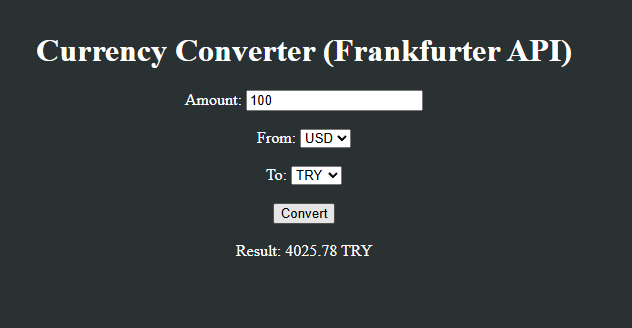

# Currency Converter (Frankfurter API)

A simple Vue.js app for converting currencies.  
- **Amount:** The amount to convert  
- **From:** Source currency (USD, EUR, TRY)  
- **To:** Target currency (USD, EUR, TRY)

Click the "Convert" button to fetch exchange rates from the Frankfurter API and display the result.  
Loading and error messages are shown accordingly.

## Overview
- Move API calls (Axios or Fetch) to a separate file (`api.js`).
- Use `async/await` to handle asynchronous calls.
- Pass parameters from the component to the API function.
- Import and call the API function inside Vue 3 components.
